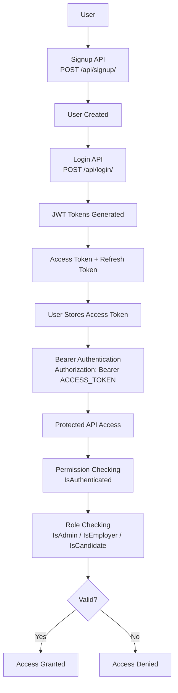

# JWT Authentication Flow

## Authentication Workflow Explanation

1. User registers using the signup API.
2. User logs in using the login API.
3. The server generates:
   - Access Token (expires in 30 minutes)
   - Refresh Token (expires in 1 day, rotated and blacklisted after use)
4. The client stores the access token.
5. The client sends `Authorization: Bearer ACCESS_TOKEN` with every
   protected API request.
6. Django REST Framework validates:
   - Token validity
   - Token expiry
   - User authentication
   - User permissions
7. If validation succeeds: **Access Granted**.
8. If validation fails: **Access Denied**, and the attempt is logged via
   `core/security.py::log_unauthorized_access` (see
   [SECURITY_AUDIT.md](SECURITY_AUDIT.md)).