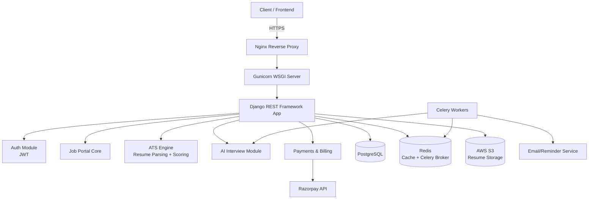
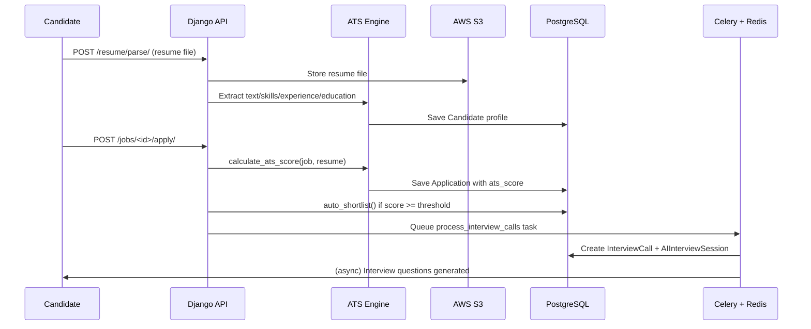
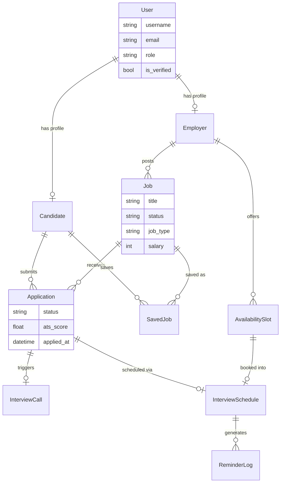
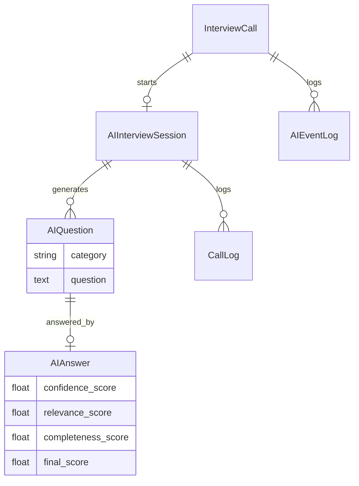
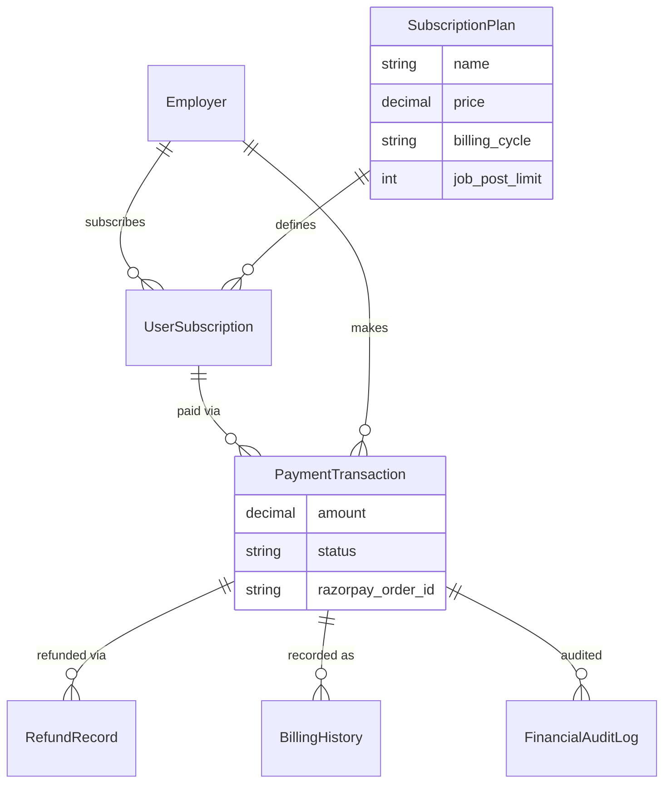
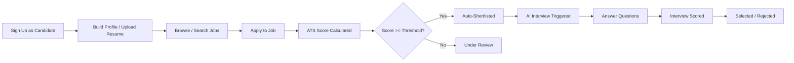
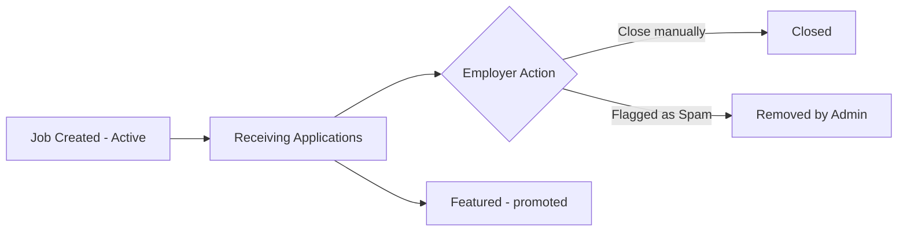
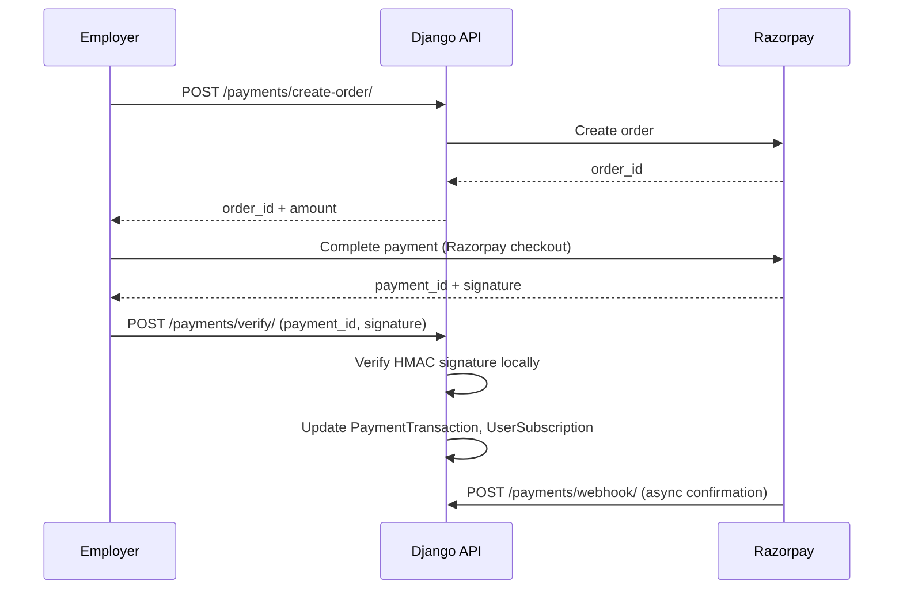

# Zecpath Backend — Architecture Documentation

This document describes Zecpath's system architecture: how the major
components fit together, how data flows through the system, and how the
database is structured.

---

## 1. System Breakdown

Zecpath is built as a single Django monolith with logically separate modules
inside it. Each module owns a distinct responsibility:

**Authentication** — JWT-based auth (`djangorestframework-simplejwt`) issuing
short-lived access tokens (30 min) and longer-lived refresh tokens (1 day,
rotated and blacklisted after use). Three roles: Candidate, Employer, Admin,
distinguished by the `User.role` field.

**Job Portal Core** — Job postings, applications, saved jobs, and
candidate/employer profiles. This is the transactional heart of the system:
`Job`, `Application`, `SavedJob` models with indexes on frequently filtered
fields (status, location, job type) to keep listing/search queries fast as
the job pool grows.

**ATS Engine** — Resume parsing (`core/utils.py`: text, skills, experience,
and education extraction from PDF/DOCX) followed by a rules-based scoring
engine (`calculate_ats_score`) that compares a candidate's parsed resume
against a job's requirements, producing a numeric match score
(`Application.ats_score`) used for auto-shortlisting.

**AI Automation** — A simulated AI interview pipeline: once a candidate is
shortlisted, an `InterviewCall` is created, which triggers an
`AIInterviewSession` with a rule-based question engine
(`AIQuestion`/category-based) and an answer evaluator that scores each
`AIAnswer` on confidence, relevance, and completeness. Fully self-contained —
no external AI API calls, by design, for cost and reliability while learning
the system.

**Payments & Billing** — Razorpay integration for subscription payments.
Covers order creation, signature verification, capture, and Razorpay
webhooks, backed by `PaymentTransaction`, `BillingHistory`, `RefundRecord`,
and `FinancialAuditLog` for a full financial audit trail.

**Background Processing** — Celery + Redis handle asynchronous work: AI
interview call processing, email notifications (with retry logic), and
interview reminders, so these don't block the request/response cycle.

**Deployment Layer** — Gunicorn (systemd-managed, auto-restart) behind Nginx
as a reverse proxy, PostgreSQL as the primary datastore, Redis for both
Celery's broker and Django's query cache, and AWS S3 for resume file storage.

---

## 2. High-Level Architecture

---

## 3. Service Interaction Diagram

Shows how a resume upload flows through the ATS engine, and how a shortlist
triggers the AI interview pipeline asynchronously via Celery.

---

## 4. Database Schema (ERD)

### Core Domain — Users, Jobs, Applications

### AI Interview Domain

### Billing Domain

---

## 5. Key User Flows

### Candidate Flow

### Employer Flow

```mermaid
flowchart LR
    A[Sign Up as Employer] --> B[Admin Approval]
    B --> C[Post Job]
    C --> D[Receive Applications]
    D --> E[View Ranked Candidates]
    E --> F[Review / Shortlist]
    F --> G[Set Availability Slots]
    G --> H[Candidate Books Interview]
    H --> I[Review Interview Score]
    I --> J[Select Candidate]
```

### Job Lifecycle

### Payment Flow

---

## 6. Module-Wise Reference

| Module | Key Files |
|---|---|
| Auth | `core/views/auth.py` |
| Jobs | `core/views/jobs.py`, `core/models.py::Job` |
| Applications | `core/views/applications.py`, `core/models.py::Application` |
| ATS Engine | `core/utils.py`, `core/services/application_service.py` |
| AI Interview | `core/services/ai_bridge.py`, `core/services/answer_evaluator.py`, `core/services/question_engine.py` |
| Reminders | `core/services/reminder_service.py`, `core/tasks.py` |
| Payments | `core/views/billing.py`, `core/services/payment_service.py`, `core/services/financial_security_service.py` |
| Analytics | `core/services/analytics_service.py` |
| Admin | `core/views/admin.py` |

For endpoint-level detail, see [API_REFERENCE.md](API_REFERENCE.md). For
deployment steps, see [SETUP_GUIDE.md](SETUP_GUIDE.md).